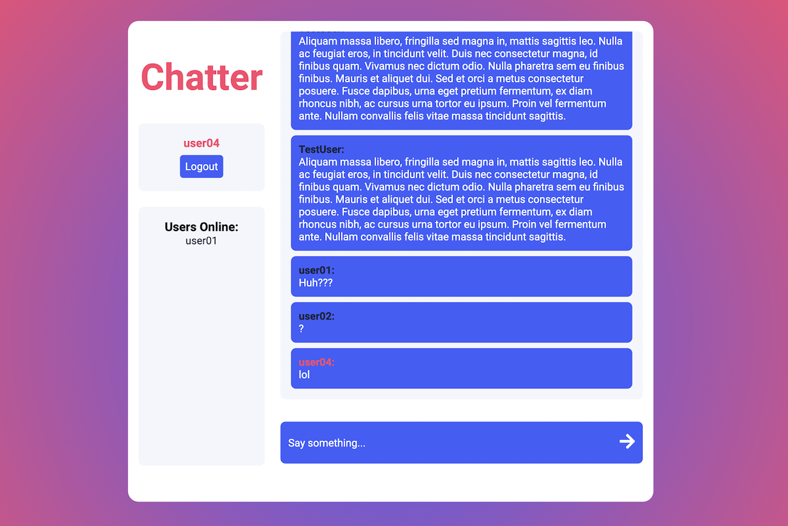

# Chatter

## Table of contents
- [Overview](#overview)
- [My process](#my-process)
  - [Built with](#built-with)
  - [Application Structure](#application-structure)
  - [Database Structure](#database-structure)
  - [Useful resources](#useful-resources)
- [Author](#author)

## Overview

A React chat application built with Firebase Authentication and Realtime database. Users can create an account and chat with other users. A presence system also allows everyone to see who else is online at any given time.

[Live Demo](https://chatter-app-7.netlify.app)

## My process
### Built with

- React
- React Router
- Firebase Authentication
- Firebase Realtime Database

### Application Structure 

The primary routing logic of the application is stored within the main App component. There are two public routes (signup/login) and one private route (the chat itself); these public and private routes are React higher order components. Firebase Authentication features an event listener that detects when a user's authentication status changes, and when this happens the user is routed to the correct page accordingly. If the user is authenticated then they are directed to the main chat page, and if they are not authenticated then they are directed to the login page.

The login and signup pages are similar, but the signup page includes a username field as well. Instead of utilizing Firebase's built in 'display name' property on the user object, I opted to create a custom 'user' node within the database to store each user's information, including their username and email address. These user nodes are related to the built-in Authentication data by each user's automatically generated unique 'uid.' Firebase Authentication and custom logic were combined to handle form validation; all email addresses and usernames must be unique, or an account cannot be created.

The chat page shows all chats, the current user, and all other users that are currently online. When the component is initially loaded, two listeners are set up to sync messages and users' online status with the database. When the form is submitted, a new message and corresponding meta data is pushed to the database.  Inline styling was utilized to show the current user's username in a different color than everyone else's for easy differentiation. 

### Database Structure 

Firebase's Realtime Database is utilized for storage. The Realtime DB can be conceptualized as a JSON tree hosted within the cloud. Chatter uses three main nodes: chat, online, and users.

The chat node stores all of the application's chats, including meta-data about each chat such as a timestamp, the user's unique id created by Firebase Authentication, and their unique username.

The online node relates each user's unique id created by Firebase Authentication and a boolean indicating whether not the current user is online.

The online node relates each user's unique id created by Firebase Authentication and their username/email address. 

### Useful resources

- [React Documentation](https://reactjs.org/)
- [Firebase Documentation](https://firebase.google.com/docs)

## Author

- Jacob Stewart
- Website - [https://jacobstewart.dev/](https://jacobstewart.dev/)
