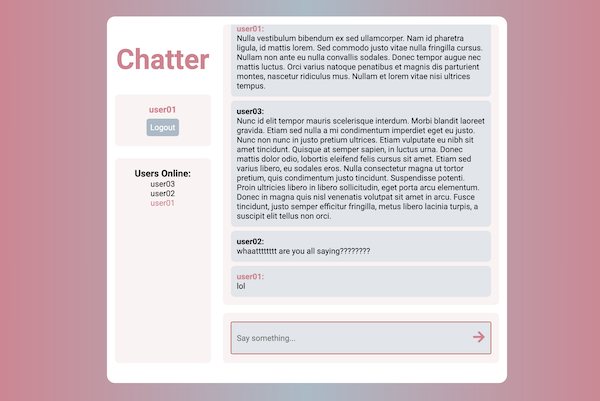

# Chatter

## Table of contents
- [Overview](#overview)
- [My process](#my-process)
  - [Built with](#built-with)
  - [Application Structure](#application-structure)
  - [Database Structure](#database-structure)
  - [What I learned](#what-i-learned)
  - [Continued development](#continued-development)
  - [Useful resources](#useful-resources)
- [Author](#author)

## Overview

A React chat application built with Firebase Authentication and Realtime database. Users can create an account and chat with other users. A presence system also allows everyone to see who else is online at any given time.

[Live Demo](https://chatter-app-7.netlify.app)

## My process
### Built with

- React
- React Router
- Firebase Authentication
- Firebase Realtime Database

### Application Structure 

The primary routing logic of the application is stored within the main App component. There are two public routes (signup/login) and one private route (the chat itself). Firebase Authentication features an event listener that detects when a user's authentication status changes, and when this happens the user is routed to the correct page accordingly. If the user is authenticated then they are directed to the main chat page, and if they are not authenticated then they are directed to the login page.

The login and signup pages are similar, but the signup page includes a username field as well. Firebase Authentication and custom logic were combined to handle form validation. 

The chat room shows all chats, the current user, and all other users that are currently online. Inline styling was utilized to show the current user's username in a different color than everyone else's for easy differentiation. 

### Database Structure 

-----COMING SOON-----

### What I learned

-----COMING SOON-----

### Continued development

-----COMING SOON-----

### Useful resources

- [React Documentation](https://reactjs.org/)
- [Firebase Documentation](https://firebase.google.com/docs)

## Author

- Jacob Stewart
- Website - [https://jacobstewart.dev/](https://jacobstewart.dev/)
